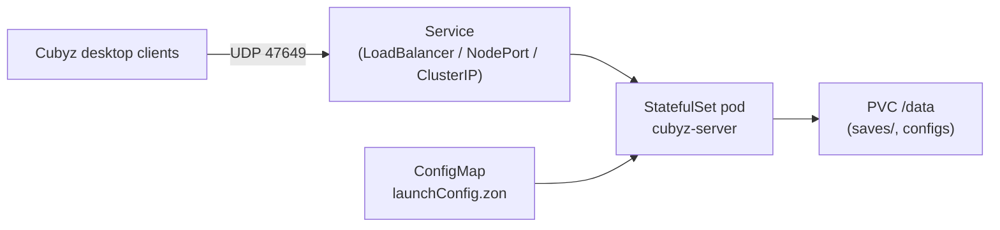

# cubyz-server

Helm chart that runs a dedicated [Cubyz](https://github.com/PixelGuys/Cubyz)
voxel game server on Kubernetes.

The chart deploys:

- a single-replica `StatefulSet` running the headless Cubyz server,
- a `PersistentVolumeClaim` mounted at `/data` for world saves and configs,
- a `ConfigMap` that renders `launchConfig.zon` from the chart values, and
- by default a `Service` of type `LoadBalancer` exposing UDP `47649` to clients.



## Requirements

- Kubernetes 1.25+
- A storage class capable of provisioning `ReadWriteOnce` volumes (when
  `persistence.enabled=true`, which is the default).
- A `cubyz-server` container image built from the upstream `Dockerfile` /
  `Dockerfile.release`. Defaults to `ghcr.io/pixelguys/cubyz-server:<chart appVersion>`.

## Install

From the OCI registry:

```bash
helm install cubyz oci://ghcr.io/pixelguys/charts/cubyz-server
```

From a local checkout (useful while developing the chart or the image):

```bash
helm install cubyz ./charts/cubyz-server \
  --set image.repository=cubyz-server \
  --set image.tag=dev
```

Pin a specific server version:

```bash
helm upgrade --install cubyz oci://ghcr.io/pixelguys/charts/cubyz-server \
  --version 0.1.0 \
  --set image.tag=v1.2.3
```

## Uninstall

```bash
helm uninstall cubyz
```

The PersistentVolumeClaim `data-<release>-cubyz-server-0` survives the
uninstall on purpose. Delete it manually if you also want to discard the
world:

```bash
kubectl delete pvc data-cubyz-cubyz-server-0
```

## Exposing the server

Cubyz speaks **UDP** on port `47649`. UDP cannot be tunnelled with
`kubectl port-forward`, so the chart offers four ways to reach the pod:

### LoadBalancer (default)

Best for cloud environments that can provision an external IP. Clients
connect to `udp://<external-ip>:47649`.

```yaml
service:
  type: LoadBalancer
  port: 47649
  externalTrafficPolicy: Local   # preserves client source IPs
  loadBalancerIP: ""             # optionally pin a specific IP
  loadBalancerSourceRanges: []   # restrict access by CIDR
```

### NodePort

Best for bare-metal clusters without an external load balancer. Pick a
port inside the cluster's `--service-node-port-range` (default `30000-32767`).

```yaml
service:
  type: NodePort
  nodePort: 30649
```

Connect with `udp://<any-node-ip>:30649`.

### ClusterIP

Only reachable from inside the cluster. Use this for testing with a pod
or a sidecar; you cannot port-forward UDP to a desktop client.

```yaml
service:
  type: ClusterIP
```

### Host network

Skips the `Service` entirely and binds UDP `47649` directly on the node
that runs the pod. Useful for low-latency dedicated boxes or when the
node already has a public address.

```yaml
hostNetwork:
  enabled: true
nodeSelector:
  kubernetes.io/hostname: my-game-node
```

When `hostNetwork.enabled=true` the chart sets
`dnsPolicy: ClusterFirstWithHostNet` automatically.

## World configuration

The container reads `launchConfig.zon` mounted from a `ConfigMap`. All
relevant fields are exposed in `values.yaml`:

```yaml
world:
  name: world                 # save directory under /data/saves/<name>
  preset: "cubyz:default"     # asset preset for new worlds
  seed: ""                    # quoted string; empty means random
  createIfMissing: true       # bootstrap the save on first start
  preferredAuthenticationAlgorithm: ""
```

When `createIfMissing` is `true` and `/data/saves/<world.name>` does not
exist, the server generates a fresh world on startup using `world.preset`
and `world.seed`. Existing saves are never overwritten.

To migrate an existing save into a fresh install, copy it into the PVC
before scaling the StatefulSet up, e.g.:

```bash
kubectl cp ./my-world cubyz-cubyz-server-0:/data/saves/world
```

## Persistence

```yaml
persistence:
  enabled: true
  mountPath: /data
  size: 10Gi
  storageClass: ""        # empty -> cluster default
  accessMode: ReadWriteOnce
  annotations: {}
```

Setting `persistence.enabled=false` falls back to an `emptyDir`. World
saves are then **lost on every pod restart** -- only do this for ephemeral
testing.

## Granting admin rights

The server starts with **no administrators**. Once you have connected at
least once with the desktop client your account is registered (under your
Ed25519 key) but has no permissions yet. Bootstrap an admin like this:

1. Connect once with the desktop client. Note your in-game player index
   (visible in the server logs as `Player <index> connected`, or via
   `/list` if another admin already exists).
2. Have an account that is already in the `whitelist` group with the root
   permission grant the same to your player index in-game:

   ```text
   /perm add whitelist @<playerIndex> /
   ```

   `/` is the root permission path; granting it makes the target a full
   admin. Use a more specific path (for example `/cmd/teleport`) to
   delegate just one capability.

3. The very first install has no admin to run the command above. The
   recommended bootstrap is to attach to the server pod and use the
   server console:

   ```bash
   kubectl exec -it cubyz-cubyz-server-0 -- /app/Cubyz   # not interactive in headless mode
   ```

   Because the headless server does not currently accept stdin, the
   simplest bootstrap is to:

   - stop the server (`kubectl scale statefulset cubyz-cubyz-server --replicas=0`),
   - edit `/data/saves/<world>/players/<your-key>.zig.zon` in the PVC and
     add `"whitelist": ["/"]` to the `permissions` map,
   - scale back up.

   See the upstream Cubyz documentation for the latest bootstrap
   procedure -- the in-game `/perm` command is the long-term mechanism.

To revoke admin rights later:

```text
/perm remove whitelist @<playerIndex> /
```

## Probes

UDP cannot be probed via `tcpSocket` and Cubyz exposes no HTTP endpoint.
The chart emits an `exec` probe that scans `/proc/net/udp{,6}` for the
configured `containerPort`. Override `livenessProbe.exec.command` /
`readinessProbe.exec.command` if you need a different check, or disable
the probes entirely with `livenessProbe.enabled=false`.

## Values reference

### Image

| Key | Default | Description |
| --- | --- | --- |
| `image.repository` | `ghcr.io/pixelguys/cubyz-server` | Image repository. |
| `image.tag` | `""` (chart `appVersion`) | Override the container tag. |
| `image.pullPolicy` | `IfNotPresent` | Image pull policy. |
| `imagePullSecrets` | `[]` | Secrets for pulling the image. |

### Naming

| Key | Default | Description |
| --- | --- | --- |
| `nameOverride` | `""` | Override the chart name portion of resource names. |
| `fullnameOverride` | `""` | Override the full release name. |

### Service account

| Key | Default | Description |
| --- | --- | --- |
| `serviceAccount.create` | `true` | Create a dedicated ServiceAccount. |
| `serviceAccount.automount` | `false` | Mount the SA token into the pod. The server does not need API access. |
| `serviceAccount.annotations` | `{}` | Annotations on the ServiceAccount. |
| `serviceAccount.name` | `""` | Use an existing ServiceAccount instead of creating one. |

### Pod metadata

| Key | Default | Description |
| --- | --- | --- |
| `replicaCount` | `1` | Number of replicas. The server is single-instance; do not raise this. |
| `podAnnotations` | `{}` | Extra pod annotations. |
| `podLabels` | `{}` | Extra pod labels. |
| `priorityClassName` | `""` | Optional `PriorityClass`. |
| `terminationGracePeriodSeconds` | `60` | Time the pod has to flush chunks on `SIGTERM`. |
| `updateStrategy.type` | `RollingUpdate` | StatefulSet update strategy. |

### Security

| Key | Default | Description |
| --- | --- | --- |
| `podSecurityContext.runAsNonRoot` | `true` | |
| `podSecurityContext.runAsUser` | `1000` | |
| `podSecurityContext.runAsGroup` | `1000` | |
| `podSecurityContext.fsGroup` | `1000` | Ensures the PVC is writable by the `cubyz` user. |
| `securityContext.allowPrivilegeEscalation` | `false` | |
| `securityContext.capabilities.drop` | `[ALL]` | |
| `securityContext.readOnlyRootFilesystem` | `true` | The server only writes to `/data`. |

### World

| Key | Default | Description |
| --- | --- | --- |
| `world.name` | `world` | Save directory under `<cubyzDir>/saves/`. |
| `world.preset` | `cubyz:default` | Asset preset used when a fresh world is created. |
| `world.seed` | `""` | World seed used by `createIfMissing`. Quote large numbers to avoid YAML precision loss. Empty string -> random. |
| `world.createIfMissing` | `true` | Bootstrap the save on first start when it does not exist. |
| `world.preferredAuthenticationAlgorithm` | `""` | Override the server's preferred auth algorithm (default ed25519). |

### Persistence

| Key | Default | Description |
| --- | --- | --- |
| `persistence.enabled` | `true` | Mount a PVC at `/data`. |
| `persistence.mountPath` | `/data` | Must match `cubyzDir` in `launchConfig.zon`. |
| `persistence.size` | `10Gi` | Requested PVC size. |
| `persistence.storageClass` | `""` | Empty -> cluster default. |
| `persistence.accessMode` | `ReadWriteOnce` | |
| `persistence.annotations` | `{}` | Extra PVC annotations. |

### Networking

| Key | Default | Description |
| --- | --- | --- |
| `service.type` | `LoadBalancer` | `ClusterIP`, `NodePort` or `LoadBalancer`. |
| `service.port` | `47649` | UDP port published by the Service. |
| `service.nodePort` | `""` | Pin a specific node port when `type=NodePort`. |
| `service.externalTrafficPolicy` | `Local` | Preserves client source IPs. |
| `service.loadBalancerIP` | `""` | Optional fixed LB IP. |
| `service.loadBalancerSourceRanges` | `[]` | CIDRs allowed to reach the LB. |
| `service.annotations` | `{}` | Extra annotations on the Service. |
| `containerPort` | `47649` | UDP port the server listens on inside the pod. |
| `hostNetwork.enabled` | `false` | Bind the host network instead of using a Service. |

### Resources & probes

| Key | Default | Description |
| --- | --- | --- |
| `resources.requests` | `cpu: 500m`, `memory: 512Mi` | |
| `resources.limits` | `cpu: 2`, `memory: 2Gi` | |
| `livenessProbe.enabled` | `true` | Disable for noisy environments. |
| `livenessProbe.initialDelaySeconds` | `30` | |
| `livenessProbe.periodSeconds` | `30` | |
| `readinessProbe.enabled` | `true` | |
| `readinessProbe.initialDelaySeconds` | `10` | |
| `readinessProbe.periodSeconds` | `15` | |

### Scheduling & policies

| Key | Default | Description |
| --- | --- | --- |
| `nodeSelector` | `{}` | |
| `tolerations` | `[]` | |
| `affinity` | `{}` | |
| `podDisruptionBudget.enabled` | `false` | Off by default since the StatefulSet is single-replica. |
| `podDisruptionBudget.maxUnavailable` | `1` | |
| `networkPolicy.enabled` | `false` | Restrict traffic to the pod. |
| `networkPolicy.ingressCIDRs` | `[0.0.0.0/0]` | CIDRs allowed to reach UDP `containerPort`. |
| `extraEnv` | `[]` | Extra env vars passed to the container. |
| `extraArgs` | `[]` | Extra args appended to `/app/Cubyz`. |

See [`values.yaml`](./values.yaml) for the authoritative list of options.

## Troubleshooting

- **`kubectl port-forward` does not work.** That is expected: Kubernetes
  port-forwarding is TCP only. Use `service.type=NodePort` or
  `LoadBalancer`, or enable `hostNetwork`.
- **Clients see the cluster IP instead of their real address.** Set
  `service.externalTrafficPolicy: Local` (the default) so the kube-proxy
  does not SNAT incoming UDP packets.
- **The pod restarts in a crash loop right after install.** Inspect
  `kubectl logs cubyz-cubyz-server-0`. Common causes are a missing
  `world.preset`, a non-writable PVC (set `podSecurityContext.fsGroup`),
  or attempting to reuse a save created by an incompatible server
  version.
- **Save data is gone after upgrade.** Confirm `persistence.enabled=true`
  and that the PVC `data-<release>-cubyz-server-0` still exists; Helm
  does not delete PVCs on uninstall but a manual `kubectl delete pvc`
  will.
